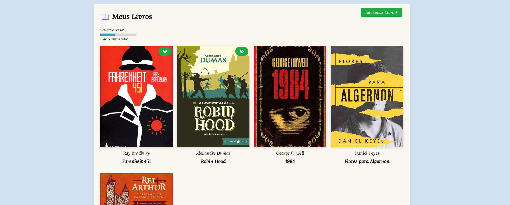

<h1 align="center">
    📖 Books-app
</h1>

<p align="center">
  <a href="#features">Features</a> •
  <a href="#how-it-works">How to run the application</a> • 
  <a href="#tech-stack">Techs used</a>
</p>

<div align="center"> 
	
</div>

## Features

- [x] List all your books
- [x] Mark then as finished or not
- [x] Show your progress
- [x] Add new Books

---

## How to run the application

You will need to have [Git](https://git-scm.com) and [Node.js](https://nodejs.org/en/) installed to run the project:

#### Running the app

```bash

# Clone this repository
$ git clone https://github.com/Pdro-marqss/books-app-vue.git

# Access the project folder in your terminal
$ cd books-app-vue

# Install the dependencies
$ npm install

# Run the application in development mode
$ npm run dev

```

---

## Techs used

Tools used in the construction of this project:

- **[Vue](https://vuejs.org/)**
- **[Vite](https://vitejs.dev/)**

---
